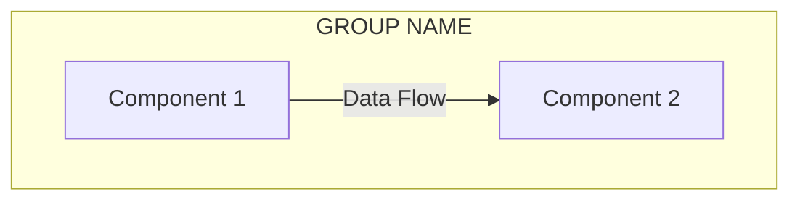

# Professional Proposal Generator System

## Overview

This is a **professional proposal generation system** that creates high-quality PDF documents from Markdown source files. The system combines:

- **Markdown** for easy content editing
- **Mermaid** for architecture diagrams
- **Playwright** for UI mockup screenshots
- **Pandoc + XeLaTeX** for professional PDF generation
- **Custom LaTeX templates** for modern, branded design
- **Docker/Podman** for consistent build environment

**Use Case:** Generate client proposals for software development projects with technical analysis, architecture diagrams, UI mockups, cost breakdowns, and professional branding.

## Key Features

✅ **Modern PDF Design** - Custom LaTeX template with professional typography (Lato font)
✅ **Architecture Diagrams** - Auto-generated from Mermaid with full label support
✅ **UI Mockups** - Screenshot generation with Playwright
✅ **Technical Analysis** - VPS calculations, resource planning, cost comparisons
✅ **Reproducible Builds** - Docker-based build ensures consistency
✅ **Version Control** - All source files in Markdown, easy to track changes
✅ **Optimized** - 890MB Docker image (70% smaller than baseline)

## System Architecture

```
┌─────────────────────────────────────────────────────────────────┐
│                      SOURCE FILES (src/)                         │
├─────────────────────────────────────────────────────────────────┤
│ proposal.md          → Main proposal content (Markdown)          │
│ template.tex         → Custom LaTeX template (styling)           │
│ diagram.mmd          → Architecture diagram (Mermaid)            │
│ mermaid-config.json  → Diagram styling configuration             │
│ diagram.css          → Additional diagram styles                 │
│ assets/              → Static images (logo, mockup screenshots)  │
│ mockups/screens.html → UI mockups for screenshot generation      │
└─────────────────────────────────────────────────────────────────┘
                                    ↓
┌─────────────────────────────────────────────────────────────────┐
│                   BUILD PROCESS (npm run build)                  │
├─────────────────────────────────────────────────────────────────┤
│ 1. Clean         → Remove old dist/ folder                       │
│ 2. Prepare       → Copy assets, convert logo SVG→PNG             │
│ 3. Generate      → Create diagram PNG with mmdc + Playwright     │
│ 4. Screenshot    → Capture UI mockups with Playwright            │
│ 5. PDF           → Pandoc + XeLaTeX in Docker container          │
└─────────────────────────────────────────────────────────────────┘
                                    ↓
┌─────────────────────────────────────────────────────────────────┐
│                    OUTPUT (dist/)                                │
├─────────────────────────────────────────────────────────────────┤
│ proposal.pdf     → Final professional PDF document               │
│ assets/          → Generated images (diagram.png, screenshots)   │
└─────────────────────────────────────────────────────────────────┘
```

## Quick Start

### 1. Build Docker Image (Once)
```bash
podman build -t endymuhardin/pandoc-latex .
```

### 2. Install Dependencies
```bash
npm install
```

### 3. Generate Proposal PDF
```bash
npm run build
```

Output: `dist/proposal.pdf`

## Project Structure

```
.
├── src/                           # SOURCE FILES
│   ├── proposal.md               # Main proposal content (Markdown)
│   ├── template.tex              # Custom LaTeX template for PDF styling
│   ├── diagram.mmd               # Architecture diagram (Mermaid syntax)
│   ├── mermaid-config.json       # Mermaid theme and styling config
│   ├── diagram.css               # Additional CSS for diagram rendering
│   ├── assets/                   # Static assets
│   │   ├── logo-artivisi.svg     # Company logo (SVG)
│   │   └── mockup_*.png          # UI mockup screenshots
│   └── mockups/
│       └── screens.html          # HTML mockups for Playwright screenshot
│
├── scripts/
│   └── capture_screens.js        # Playwright script for screenshot generation
│
├── dist/                          # GENERATED OUTPUT (gitignored)
│   ├── proposal.pdf              # Final PDF output
│   └── assets/                   # Generated images
│       ├── logo-artivisi.png     # Converted logo (SVG→PNG)
│       ├── diagram.png           # Generated diagram with labels
│       └── mockup_*.png          # Copied screenshots
│
├── Dockerfile                     # Docker image for Pandoc + XeLaTeX
├── package.json                   # NPM scripts and dependencies
├── CLAUDE.md                      # Instructions for AI assistants
├── .gitignore                     # Excludes dist/ and temp files
└── README.md                      # This file
```

---

## File-by-File Guide

### Core Source Files

#### `src/proposal.md`
Main proposal content in Markdown format. Contains:
- Cover page metadata (title, author, client, date)
- Project description and scope
- Architecture diagram reference
- Feature list
- UI mockups
- Technical analysis and VPS calculations
- Task breakdown and pricing
- Contact information

**Customization:** Edit this file for your proposal content.

#### `src/template.tex`
Custom LaTeX template that defines the PDF styling:
- Cover page design with company branding
- Typography (Lato font family)
- Color scheme (customizable)
- Header/footer layout
- Table of contents formatting
- Image sizing and positioning

**Customization:** Modify colors, fonts, spacing, or cover page design.

#### `src/diagram.mmd`
Mermaid diagram source for system architecture:
- Uses `graph TD` (top-down flowchart)
- Subgraphs for logical grouping
- Custom styling with CSS classes
- Labels for data flow and protocols

**Customization:** Update nodes, connections, and labels for your architecture.

#### `src/mermaid-config.json`
Configuration for Mermaid diagram rendering:
- Theme selection
- Font size and family
- Colors and styling
- Padding and layout settings

**Customization:** Adjust theme, fonts, or diagram dimensions.

#### `src/diagram.css`
Additional CSS styles for diagram elements:
- Text overflow handling
- Label positioning
- Custom styling rules

**Customization:** Add CSS rules for specific diagram needs.

### Build Configuration

#### `Dockerfile`
Defines the Docker image with:
- Base: `debian:stable-slim`
- Pandoc (Markdown → PDF converter)
- XeLaTeX (PDF rendering engine)
- LaTeX packages (fonts, graphics)
- `librsvg2-bin` (for SVG → PNG conversion)
- `fonts-lato` (typography)

**Size:** 890 MB (optimized, removed unnecessary packages)

**Customization:** Add fonts or LaTeX packages if needed.

#### `package.json`
NPM scripts for build automation:
- `clean` - Remove dist/ folder
- `prepare` - Copy assets, convert logo
- `generate:diagram` - Create diagram PNG with mmdc
- `generate:screenshots` - Capture UI mockups
- `build:assets` - Run both diagram and screenshot generation
- `build:pdf` - Generate PDF in Docker container
- `build` - Complete build pipeline

**Customization:** Update metadata fields in `build:pdf` script.

---

## Customizing for Your Proposal

### 1. Update Company Branding

**Logo:**
1. Replace `src/assets/logo-artivisi.svg` with your logo
2. Ensure SVG has proper viewBox for aspect ratio
3. Logo will auto-convert to PNG during build

**Colors (in `src/template.tex`):**
```latex
\definecolor{primaryColor}{HTML}{1a365d}      % Dark blue
\definecolor{secondaryColor}{HTML}{3182ce}    % Medium blue
\definecolor{accentColor}{HTML}{e2e8f0}       % Light gray
```

**Fonts (in `src/template.tex`):**
```latex
\setmainfont{Lato}[
  BoldFont={Lato Bold},
  ItalicFont={Lato Italic}
]
```

### 2. Update Proposal Content

Edit `src/proposal.md`:

**Metadata (top of file):**
```markdown
| | |
| :--- | :--- |
| **Tanggal** | 16 November 2025 |
| **Untuk** | [Client Name] |
| **Dari** | [Your Company] |
```

**Sections:**
- Section 1: Project description
- Section 2: Architecture diagram
- Section 3: Feature list
- Section 4-8: Technical content, pricing, etc.

**Images:**
```markdown
{ width=100% }
{ width=65% }
```

### 3. Update Architecture Diagram

Edit `src/diagram.mmd`:

**Basic structure:**


**Styling tips:**
- Keep box content wide enough to prevent label cropping
- Use `&nbsp;` padding in subgraph labels if needed
- Test with `npm run generate:diagram` to verify labels

### 4. Update Build Script

Edit `package.json` → `build:pdf` script:

**Change metadata:**
```bash
-M title="YOUR PROPOSAL TITLE" \
-M author.name="Your Name / Company" \
-M author.affiliation="Your Title" \
-M client="[Client Name]" \
-M date="$(date +%Y-%m-%d)" \
-M website="https://yourwebsite.com/"
```

### 5. Generate UI Mockups

**Option A: Use screenshots**
1. Create mockups (Figma, HTML, etc.)
2. Take screenshots
3. Save as `src/assets/mockup_*.png`
4. Reference in `src/proposal.md`

**Option B: Auto-generate with Playwright**
1. Edit `src/mockups/screens.html`
2. Update `scripts/capture_screens.js` selectors
3. Run `npm run generate:screenshots`

---

## Build Process Details

### Individual Build Steps

```bash
# 1. Clean previous build
npm run clean

# 2. Prepare assets (copy files, convert logo)
npm run prepare

# 3. Generate diagram PNG (with mmdc + Playwright)
npm run generate:diagram

# 4. Generate UI screenshots (with Playwright)
npm run generate:screenshots

# 5. Generate PDF (Pandoc + XeLaTeX in Docker)
npm run build:pdf

# OR run everything:
npm run build
```

### How Diagram Generation Works

```bash
npx mmdc \
  -i src/diagram.mmd \              # Input Mermaid file
  -o dist/assets/diagram.png \       # Output PNG
  -c src/mermaid-config.json \       # Config file
  -C src/diagram.css \               # CSS styles
  -b transparent \                   # Transparent background
  -s 3 \                             # Scale factor
  -w 2400 -H 2000                    # Dimensions
```

**Why PNG instead of SVG?**
- LaTeX doesn't support Mermaid's HTML `foreignObject` elements
- mmdc uses Puppeteer/Playwright which properly renders all labels
- PNG ensures labels display correctly in PDF

### How PDF Generation Works

```bash
podman run --rm \
  --volume "$(pwd)/src:/src" \           # Mount source files
  --volume "$(pwd)/dist:/dist" \         # Mount output directory
  --user $(id -u):$(id -g) \             # Run as current user
  endymuhardin/pandoc-latex \             # Docker image
  --template=/src/template.tex \          # Custom LaTeX template
  --resource-path=/dist \                 # Where to find images
  --pdf-engine=xelatex \                  # PDF rendering engine
  -M title="..." \                        # Metadata variables
  --toc \                                 # Generate table of contents
  -o /dist/proposal.pdf \                 # Output file
  /src/proposal.md                        # Input Markdown
```

---

## Advanced Customization

### Adding New Sections

1. Edit `src/proposal.md`
2. Add new heading: `## **X. Section Title**`
3. Content follows in Markdown
4. Rebuild: `npm run build`

### Adding Technical Calculations

See Section 7.1 in `src/proposal.md` for example:
- Resource calculations in tables
- Technical assumptions
- Sizing formulas

### Multiple VPS/Pricing Options

See Sections 7.2 and 8 in `src/proposal.md`:
- Option A (Minimalist) vs Option B (Optimal)
- Comparison tables
- Cost breakdowns with PPN

### Custom LaTeX Packages

Edit `Dockerfile` to add packages:
```dockerfile
RUN apt-get update && \
    apt-get install -y --no-install-recommends \
    texlive-science \        # Add scientific packages
    texlive-humanities \     # Add humanities packages
    ...
```

Then rebuild Docker image: `npm run docker:build`

---

## Troubleshooting

### Common Issues

#### Diagram labels are cropped

**Problem:** Subgraph labels or box titles appear cut off in PDF.

**Solution:**
1. Make box content longer to force wider boxes
2. Use shorter subgraph labels
3. Add `&nbsp;` padding to labels: `["&nbsp;&nbsp;&nbsp;LABEL&nbsp;&nbsp;&nbsp;"]`
4. Test with: `npm run generate:diagram` and check `dist/assets/diagram.png`

#### Logo has wrong aspect ratio

**Problem:** Logo appears stretched or squashed.

**Solution:**
- Use `--keep-aspect-ratio` in rsvg-convert (already configured in `package.json`)
- Ensure SVG has proper `viewBox` attribute
- Only specify width, let height be calculated automatically

#### PDF build fails with LaTeX errors

**Problem:** Pandoc/XeLaTeX compilation errors.

**Common causes:**
1. **Special characters** - Escape `&`, `%`, `$`, `#`, `_` in Markdown
2. **Missing images** - Check all image paths in `proposal.md`
3. **Font issues** - Ensure Lato font is in Dockerfile
4. **Table formatting** - Verify table syntax in Markdown

**Debug:**
```bash
# Run PDF build with verbose output
npm run build:pdf 2>&1 | tee build.log
```

#### Docker/Podman permission errors

**Problem:** "Permission denied" when writing to `dist/`

**Solution:**
```bash
# Ensure dist/ folder exists and has correct permissions
rm -rf dist
mkdir -p dist
chmod 755 dist
```

#### Playwright/mmdc fails to generate diagram

**Problem:** "Error: Could not find Chrome/Chromium"

**Solution:**
```bash
# Install Playwright browsers
npx playwright install
npx playwright install-deps
```

### Performance Optimization

**Slow builds?**
- Diagram generation: Uses Playwright (browser-based), takes ~5-10s
- PDF generation: XeLaTeX compilation, takes ~10-15s
- Total build: ~30-40s for full rebuild

**Speed up:**
- Use `npm run build:pdf` alone if only content changed
- Skip `generate:diagram` if diagram unchanged
- Docker image is cached after first build

---

## Best Practices

### Version Control

**Always commit:**
- ✅ All `src/` files (proposal.md, template.tex, diagrams, etc.)
- ✅ Dockerfile and package.json
- ✅ Scripts and configuration files
- ✅ CLAUDE.md (instructions for AI)

**Never commit:**
- ❌ `dist/` folder (build output, regenerated)
- ❌ `node_modules/` (NPM dependencies)
- ❌ `.DS_Store`, temp files
- ❌ `src/.config/`, `src/.texlive2025/` (LaTeX cache)

### Markdown Formatting

**For proper PDF rendering:**
- Use `## **X. Section Title**` for numbered sections
- Add blank lines between list items for proper spacing
- Constrain image width: `{ width=65% }` or `{ width=100% }`
- Use tables with `| :--- |` for left alignment

**Example:**
```markdown
## **3. Daftar Fitur**

1.  **Feature One**: Description of feature one.

2.  **Feature Two**: Description of feature two.

3.  **Feature Three**: Description of feature three.
```

### Diagram Best Practices

**For clear, readable diagrams:**
- Keep node labels concise but descriptive
- Use subgraphs to group related components
- Add data flow labels on edges: `|Protocol<br/>Details|`
- Test with various widths (-w parameter) to avoid cropping
- Use consistent color scheme (defined in CSS classes)

**Mermaid limitations:**
- Avoid very long text in subgraph labels (will crop)
- HTML in labels only works in PNG output (not SVG)
- Complex nested subgraphs may not render well

### Template Customization

**When modifying `template.tex`:**
- Test incremental changes (rebuild often)
- Keep backup of working version
- Comment your changes for future reference
- Use consistent spacing and indentation
- Test with different content lengths

---

## For AI Assistants: Duplicating This System

### Quick Clone Guide

To create a new proposal using this system:

1. **Clone this repository**
   ```bash
   git clone <this-repo> new-proposal-name
   cd new-proposal-name
   rm -rf .git
   git init
   ```

2. **Update branding**
   - Replace `src/assets/logo-artivisi.svg` with client/company logo
   - Edit colors in `src/template.tex` (lines with `\definecolor`)
   - Update fonts if needed (lines with `\setmainfont`)

3. **Update content**
   - Edit `src/proposal.md` - replace all proposal text
   - Update metadata table (date, client name, author)
   - Replace architecture diagram in `src/diagram.mmd`
   - Update or remove UI mockups in `src/assets/`

4. **Update build configuration**
   - Edit `package.json` → `build:pdf` script
   - Change `-M title`, `-M author.name`, `-M client`, `-M website`
   - Update `package.json` name and description

5. **Build and test**
   ```bash
   npm install
   podman build -t endymuhardin/pandoc-latex .
   npm run build
   ```

6. **Review output**
   - Check `dist/proposal.pdf`
   - Verify logo, colors, fonts, content
   - Test all links and images

### Key Customization Points

| Component | File | What to Change |
|-----------|------|----------------|
| **Company Logo** | `src/assets/logo-artivisi.svg` | Replace with new logo SVG |
| **Color Scheme** | `src/template.tex` | `\definecolor` commands (lines ~120-125) |
| **Typography** | `src/template.tex` | `\setmainfont`, `\setsansfont` (lines ~200-210) |
| **Proposal Text** | `src/proposal.md` | All sections, replace content |
| **Architecture** | `src/diagram.mmd` | System architecture diagram |
| **UI Mockups** | `src/assets/mockup_*.png` | Replace with new screenshots |
| **Metadata** | `package.json` build:pdf | Title, author, client, date, website |
| **Cover Design** | `src/template.tex` | Cover page layout (lines ~580-650) |

### Content Structure Template

Recommended proposal sections (adapt as needed):

1. **Cover Page** - Auto-generated from metadata
2. **Table of Contents** - Auto-generated with `--toc`
3. **Project Description** - What is being built
4. **Architecture Diagram** - System design visualization
5. **Feature List** - Detailed capabilities
6. **UI Mockups** - Visual design previews
7. **Scope of Work** - Tasks and deliverables
8. **Timeline & Effort** - Mandays breakdown
9. **Technical Analysis** - Infrastructure sizing, calculations
10. **VPS/Infrastructure Specs** - Server requirements
11. **Cost Breakdown** - Pricing with options
12. **Contact Information** - How to reach you

### Technical Considerations

**Docker Image:**
- Built for ARM64 and x86_64 architectures
- Optimized size: 890 MB
- Contains: Pandoc 3.x, XeLaTeX, Lato fonts, librsvg2-bin
- Rebuild if fonts or LaTeX packages change

**Diagram Generation:**
- Uses @mermaid-js/mermaid-cli (Puppeteer-based)
- Generates PNG with proper label rendering
- Scale factor 3 provides good quality for print
- Dimensions 2400x2000 prevent cropping

**PDF Generation:**
- XeLaTeX engine supports Unicode and modern fonts
- Custom template provides professional design
- Pandoc processes Markdown → LaTeX → PDF
- Resource path points to dist/ for images

**Build Performance:**
- First build: ~60s (includes Docker layer caching)
- Subsequent builds: ~30-40s
- Diagram generation: ~5-10s (browser automation)
- PDF compilation: ~10-15s (XeLaTeX)

### Common Customization Scenarios

**Scenario 1: Different project type (e.g., mobile app)**
- Update `src/diagram.mmd` with mobile architecture
- Change feature list in `src/proposal.md`
- Add mobile mockups to `src/assets/`
- Adjust technical analysis for mobile infrastructure

**Scenario 2: Multi-language proposal**
- Duplicate `src/proposal.md` → `src/proposal_en.md`
- Update `package.json` with new build script
- Keep same template, diagram, and assets
- Generate multiple PDFs: `proposal_id.pdf`, `proposal_en.pdf`

**Scenario 3: Different visual design**
- Modify `src/template.tex` cover page layout
- Change color scheme (`\definecolor` commands)
- Adjust typography (font families and sizes)
- Update header/footer design

**Scenario 4: Add technical appendices**
- Add sections to `src/proposal.md`
- Include detailed technical specs
- Add additional diagrams (`diagram2.mmd`, etc.)
- Reference in proposal with ``

---

## NPM Scripts Reference

```json
{
  "scripts": {
    "clean": "rm -rf dist",
    "prepare": "mkdir -p dist/assets && cp -r src/assets/. dist/assets/ && podman run --rm --volume \"$(pwd)/dist/assets:/data\" --entrypoint rsvg-convert endymuhardin/pandoc-latex --format png --width 600 --keep-aspect-ratio --output /data/logo-artivisi.png /data/logo-artivisi.svg",
    "generate:diagram": "npx mmdc -i src/diagram.mmd -o dist/assets/diagram.png -c src/mermaid-config.json -C src/diagram.css -b transparent -s 3 -w 2400 -H 2000 && npx mmdc -i src/diagram.mmd -o dist/assets/diagram.svg -c src/mermaid-config.json -C src/diagram.css",
    "generate:screenshots": "node scripts/capture_screens.js",
    "build:assets": "npm run generate:diagram && npm run generate:screenshots",
    "build:pdf": "podman run --rm --volume \"$(pwd)/src:/src\" --volume \"$(pwd)/dist:/dist\" --user $(id -u):$(id -g) endymuhardin/pandoc-latex --template=/src/template.tex --resource-path=/dist --pdf-engine=xelatex -M title=\"PROPOSAL PENGEMBANGAN APLIKASI MONITORING SENSOR AIR BERBASIS WEB\" -M author.name=\"Endy Muhardin / ArtiVisi Intermedia\" -M author.affiliation=\"IT Consultant\" -M client=\"[Nama Klien/Perusahaan Anda]\" -M date=\"16 November 2025\" -M website=\"https://artivisi.com/\" --toc -o /dist/proposal.pdf /src/proposal.md",
    "build": "npm run clean && npm run prepare && npm run build:assets && npm run build:pdf"
  }
}
```

---

## License & Credits

**System Architecture:**
- Pandoc - Document converter (GPL)
- XeLaTeX - PDF rendering engine
- Mermaid - Diagram generation
- Playwright - Browser automation

**Fonts:**
- Lato - Open Font License

**Created by:** Endy Muhardin / ArtiVisi Intermedia
**Website:** https://artivisi.com
