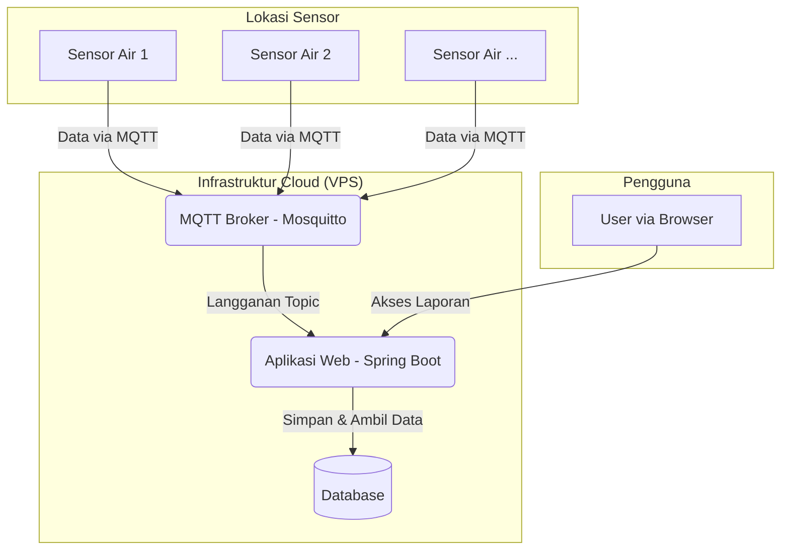

### **PROPOSAL PENGEMBANGAN APLIKASI MONITORING SENSOR AIR BERBASIS WEB**

| | |
| :--- | :--- |
| **Tanggal** | 16 November 2025 |
| **Untuk** | [Nama Klien/Perusahaan Anda] |
| **Dari** | [Nama Anda/Perusahaan Anda] |

---

#### **1. Deskripsi Aplikasi**

Aplikasi Monitoring Sensor Air adalah sebuah sistem berbasis web yang dirancang untuk menerima, memproses, dan memvisualisasikan data yang dikirim oleh sensor-sensor air secara *real-time*. Sistem ini memungkinkan pemantauan jarak jauh terhadap berbagai parameter kualitas atau level air dari banyak lokasi sekaligus.

Data dari setiap unit sensor akan dikirimkan melalui protokol MQTT ke sebuah *MQTT Broker* pusat. Aplikasi server yang dibangun menggunakan **Spring Boot 4** dan **Java 25 LTS** akan mengambil data dari broker tersebut, menyimpannya ke dalam database, dan menampilkannya dalam bentuk laporan dan grafik pada antarmuka web yang responsif.

#### **2. Diagram Arsitektur**

Diagram berikut mengilustrasikan alur data dari sensor hingga ke pengguna akhir.

#### **3. Daftar Fitur**

Aplikasi akan memiliki fitur-fitur utama sebagai berikut:
1.  **Penerimaan Data MQTT**: Kemampuan untuk terhubung ke MQTT broker dan menerima data dari topik (topic) yang telah ditentukan.
2.  **Penyimpanan Data**: Menyimpan data sensor (misalnya: level air, pH, suhu, timestamp) ke dalam database.
3.  **Dashboard Real-time**: Menampilkan data terakhir yang diterima dari sensor-sensor aktif (opsional, di luar scope utama).
4.  **Tampilan Laporan**: Menampilkan data historis dalam bentuk tabel yang dapat difilter berdasarkan rentang tanggal dan ID sensor.
5.  **Visualisasi Data**: Menampilkan grafik tren dari data sensor untuk mempermudah analisis.
6.  **Manajemen Sensor**: Fitur dasar untuk mendaftarkan atau menonaktifkan sensor baru (opsional, di luar scope utama).

#### **4. UI Mockup (Tampilan Laporan)**

Berikut adalah mockup untuk halaman laporan data sensor.

#### **5. Lingkup Pekerjaan**

1.  **Pengembangan Aplikasi**:
    *   Pengembangan backend dengan Spring Boot untuk menerima data MQTT.
    *   Pengembangan antarmuka web (frontend) untuk menampilkan laporan.
    *   Setup database untuk penyimpanan data.
2.  **Setup Infrastruktur**:
    *   Konfigurasi Virtual Private Server (VPS).
    *   Instalasi OS dan software pendukung (Java, Database, Web Server).
    *   Konfigurasi domain dan DNS.
    *   Setup sertifikat SSL (HTTPS) dengan Let's Encrypt.
3.  **Setup MQTT Broker**:
    *   Instalasi dan konfigurasi Mosquitto MQTT Broker di VPS.
    *   Pengamanan broker dengan username/password.
4.  **Deployment Aplikasi**:
    *   Deploy aplikasi Spring Boot ke VPS.
    *   Konfigurasi web server (misal: Nginx) sebagai *reverse proxy*.
    *   Testing end-to-end.

#### **6. Daftar Task, Estimasi Mandays, dan Rate**

Asumsi rate per manday: **Rp 1.500.000,-** (dapat disesuaikan).

| Kategori | Task | Estimasi (Mandays) |
| :--- | :--- | :--- |
| **Infrastruktur** | Setup VPS, Domain, & Keamanan | 2 |
| | Instalasi & Konfigurasi MQTT Broker | 1 |
| **Backend** | Inisialisasi Proyek & Database | 1 |
| | Implementasi listener MQTT | 2 |
| | Pembuatan API untuk frontend | 2 |
| **Frontend** | Desain UI/UX Laporan | 1 |
| | Integrasi API & Tampilan Tabel | 2 |
| | Implementasi Grafik Data | 2 |
| **Deployment** | Deploy Aplikasi & Testing | 2 |
| **Total** | | **15 Mandays** |

#### **7. Spesifikasi VPS**

Untuk menangani 100 sensor yang mengirim data secara periodik (misal per 1-5 menit) serta menjalankan aplikasi web dan MQTT broker, spesifikasi VPS berikut dari **Biznet Gio Cloud** direkomendasikan:

-   **Layanan**: NEO Lite
-   **Tipe**: Compute
-   **Paket**: MM 8.4 (Medium Memory)
-   **vCPU**: 4 Core
-   **RAM**: 8 GB
-   **Penyimpanan**: 60 GB SSD
-   **Estimasi Harga**: Sekitar Rp 440.000,- per bulan.

Spesifikasi ini memberikan ruang yang cukup untuk pertumbuhan data dan lalu lintas di masa depan.

#### **8. Rincian Biaya**

Berikut adalah estimasi total biaya untuk proyek ini.

| Item | Deskripsi | Biaya |
| :--- | :--- | :--- |
| **1. Biaya Development** | 15 Mandays x Rp 1.500.000,- | Rp 22.500.000,- |
| **2. Biaya Setup Infrastruktur** | Termasuk dalam biaya development | - |
| **3. Pembelian Domain (.com)** | Registrasi untuk 1 tahun | Rp 175.000,- |
| **4. Sewa VPS** | Biznet NEO Lite MM 8.4 (Rp 440.000 x 12 bln) | Rp 5.280.000,- |
| **Total Estimasi Biaya Tahun Pertama** | | **Rp 27.955.000,-** |

*Catatan: Harga domain dan VPS bersifat estimasi dan dapat berubah sesuai kebijakan penyedia layanan.*
